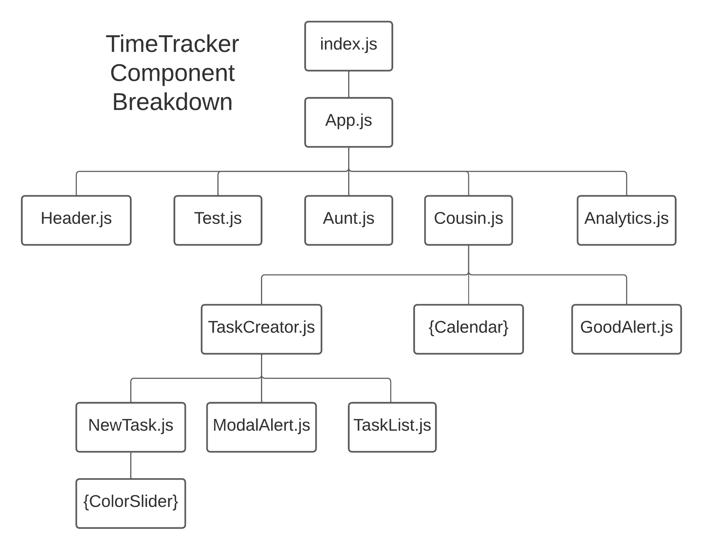

# TimeTracker
#### Created by Claire Liu, advised by Professor Justin Smith,CS 391 Independent Study in HCI (Spring 2022) Lafayette College

## Description
Have you ever wondered how you spend your time? If you track your time using TimeTracker, you might be surprised to find that you might not be spending your time like you think you are! 

I created this web app, TimeTracker, to track my time digitally. You can create Tasks representing different tasks or class you do each day (ex. Math, Computer Science,Eating, Chores) and track how you are spending your time each hour. You can see a history of how you spend your time in past days that you tracked and get some simple analytics about how you have spent your time. 

## Breakdown
This project was created in React/React Bootstrap. Here's the breakdown of the main components: 

Note that if the component is in curly braces that means that I used a component that someone else made (see Credits)

## How to Run

Run using `npm start`. 

You might have to install these additional npm packages if you don't already have them: 

`npm install react-bootstrap bootstrap`

`npm install react-color`

`npm install react-calendar`

This project also contains some tests to generate dummy data. You can use the created tests (they end with `.side` file ext) if you have the Selenium web extension installed. 

## Credits
The color picker component was adapted from https://casesandberg.github.io/react-color/ 

The calendar component was from https://github.com/wojtekmaj/react-calendar

